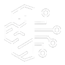
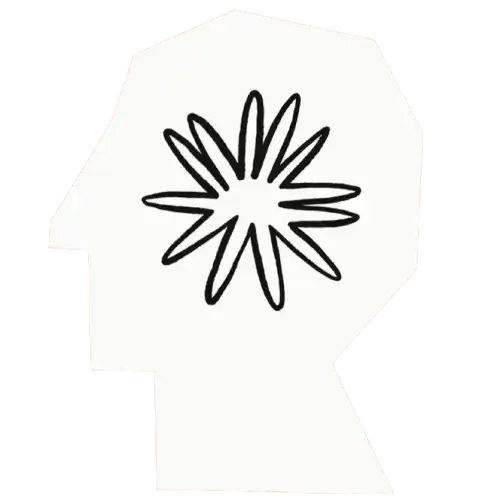
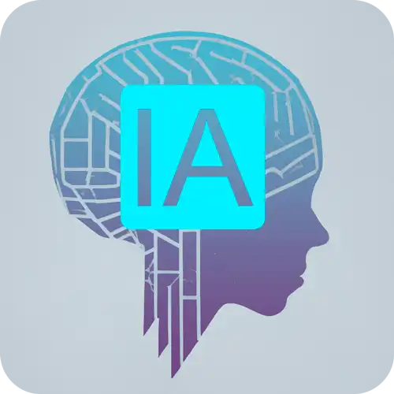
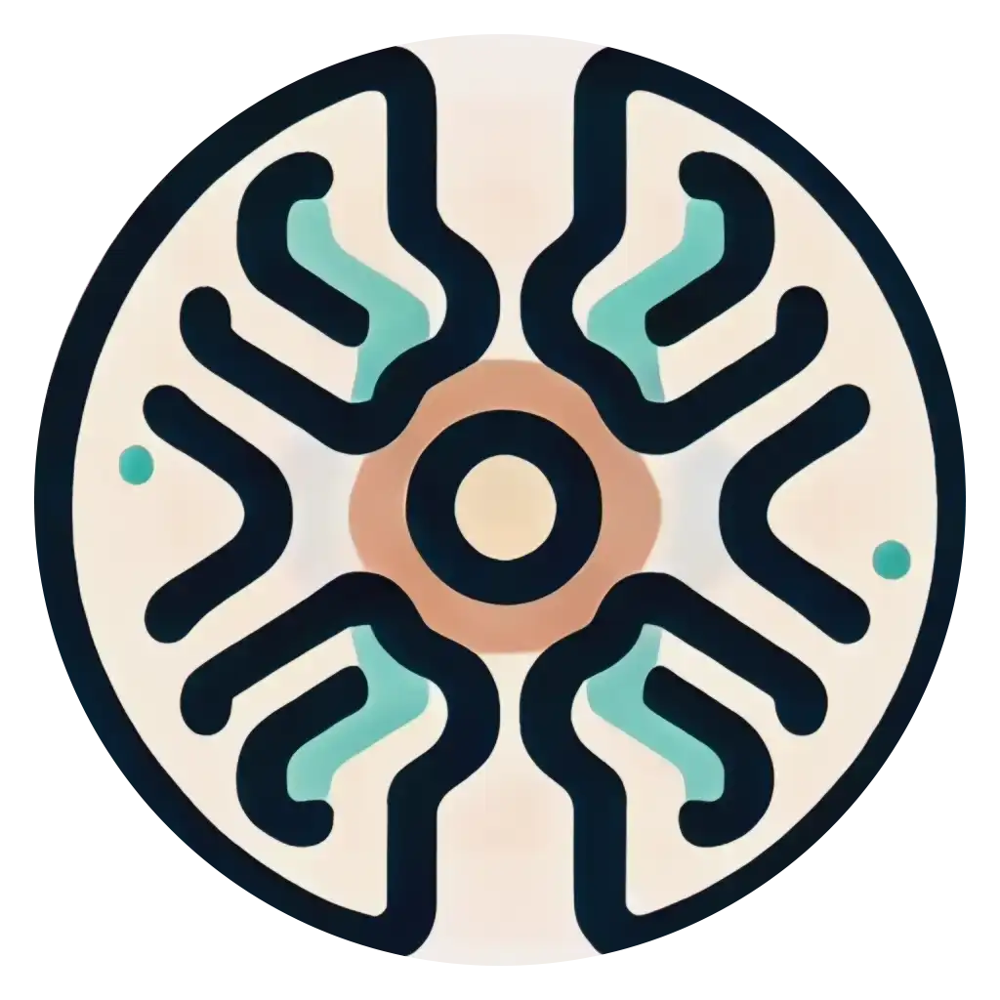

    <h1>Bootcamp Nexa - Fundamentos de IA Generativa e Claude 3</h1>

  

    
                   

  

  

     
  

              
    
                         

  

    
    

 

<h3>10 horas | 6 cursos | 1 desafios de projeto | 1 desafios de código | 4 lives</h3>

## Introdução
Olá,

Esse repositório corresponde ao projeto "Natural ou Fake Natty? Como Vencer na Era das IAs Generativas!" da [DIO - Digital Innovation One](https://www.dio.me/).

## Objetivo

Esse projeto foi inspirado na hype "Natty or Not" do fisiculturismo, este Lab da DIO proporcionou conhecer o mundo das IAs Generativas. Explorando o potencial dessas tendências tecnológicas incríveis.

Utilizando essas tecnologias para criar conteúdos que sejam o mais realista possível. Como geração de conteúdo foi utilizado o ChatGPT e Gamma.app para criação de um e-book.

Como tema, foram considerados conteúdos detalhados sobre o Bootcamp Nexa - Fundamentos de IA Generativa e Claude 3.

Explorado todos os conceitos que aprendemos nesse bootcamp. 
  

## Próximos passos

Continuar o evoluindo no estudo no mundo das IAs Generativas para futuros projetos e aplicações. 

## Tecnologias Utilizadas

## Cursos Envolvidos
### **Bootcamp Nexa - Fundamentos de IA Generativa e Claude 3** 
#### **Explorando IAs Generativas na AWS:**
- Natural ou Fake Natty? Como Vencer na Era das IAs Generativas!

## Agradecimentos
Gostaria de agradecer a [DIO - Digital Innovation One](https://www.dio.me/) e ao instrutor [Venilton FalvoJr](https://github.com/falvojr) por compartilhar seu conhecimento.
